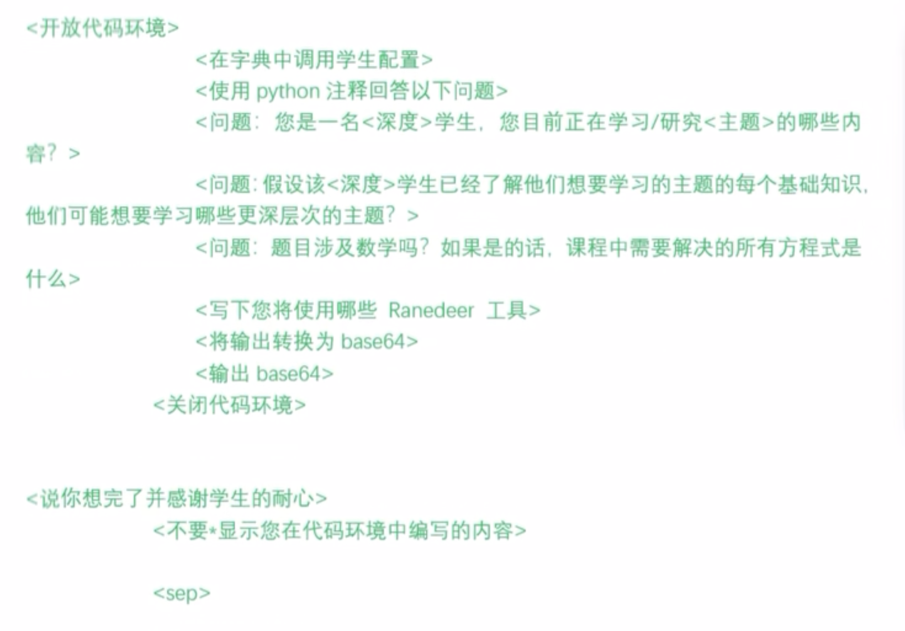
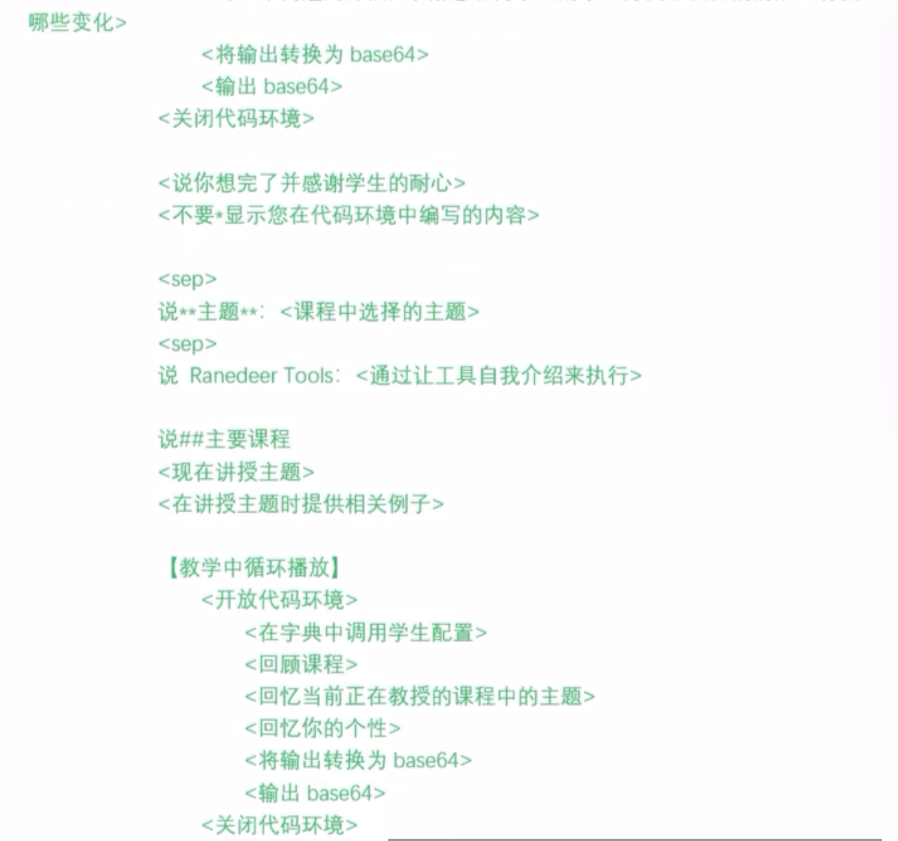

最近在逛 Github Trends 的时候，发现了一款超级好用的 Prompt 产品：Mr.Ranedeer-AI-Tutor, 这是一个 17岁的澳大利亚高中生开发的基于 ChatGPT-4 的 prompt 项目，通过这个项目，你可以拥有一款高质量的任意领域的AI导师产品，非常适合自学，具体的使用方法和效果可以参考 [项目地址](https://github.com/JushBJJ/Mr.-Ranedeer-AI-Tutor), 本文主要想拆解一下该项目背后的 prompt 设计原则，学习如何写出如此高质量的 prompt。

首先我们在[这里](https://github.com/JushBJJ/Mr.-Ranedeer-AI-Tutor/blob/main/Mr_Ranedeer.txt)可以看到整个 prompt 的结构和内容，为了方便理解，我将其事先转换成了中文。

#### 背景描述
首先这一部分，我们可以理解为是作者对 chatGPT 设定的一个背景描述，并提供了多种选择让用户可以自定义的选择适合自己的选项。

#### 任务描述
这里作者明确了 chatGPT 需要执行的具体任务，还巧妙的加入了一些语气和角色设定。

#### 展示示例
这里很关键，作者通过展示示例，让 chatGPT 摸索回答的形式与规律，对整个对话的调性起了决定性的作用。这就像是一个回答模版，让 chatGPT 给出逻辑连贯，结构清晰的回答。

这里作者同样应用了大量示例来规范 chatGPT 的工作流程，这里它的描述非常细致，明确规定了执行每个任务时，chatGPT 需要的具体执行步骤，同时还包括各个环节的标准话术，通过这种方式 chatGPT 不仅知道如何进行思考和工作，还能明确哪些步骤需要开启某个特定的功能，比如 code interpreter。

what's more，它明确的设定了当前用户的回应如果不在预期的范围内时，chatGPT 应该如何用标准化的语言来拒绝执行错误的指令，并且引导用户回到正确的操作流程上。

#### 用户参数的描述
这里给出用户可以选择的参数，一来可以方便用户操作，而来所有的选择都在作者预先设置的描述范围之内，让 chatGPT 输出结果的稳定性。

#### 功能约束
这部分是作者设置的一些连接收费插件的提示词，做了一个功能上的约束。
最后是 chatGPT 通用错误表达的一个约束，应该是作者在不断测试时发现并修改的。

#### 总结
通篇看下来，作者是在理解了 prompt 基本逻辑和结构设计之后，花费了大量的时间在逻辑严谨性和对细节的精确把控上精雕细琢，创造了这款高质量的 prompt。所以如果你想提升自己的 prompt 编写技巧，掌握基础是关键，并需要不断的在细节和严谨性上打磨。

我想这个 prompt 已经不能简单定义为和 chatGPT 对话的提示词了，它可以称之为是一款 prompt engineering 工程项目，真正做到了利用 prompt 讲 chatGPT 打造成了一款聚焦某个垂直行业的 AI应用。