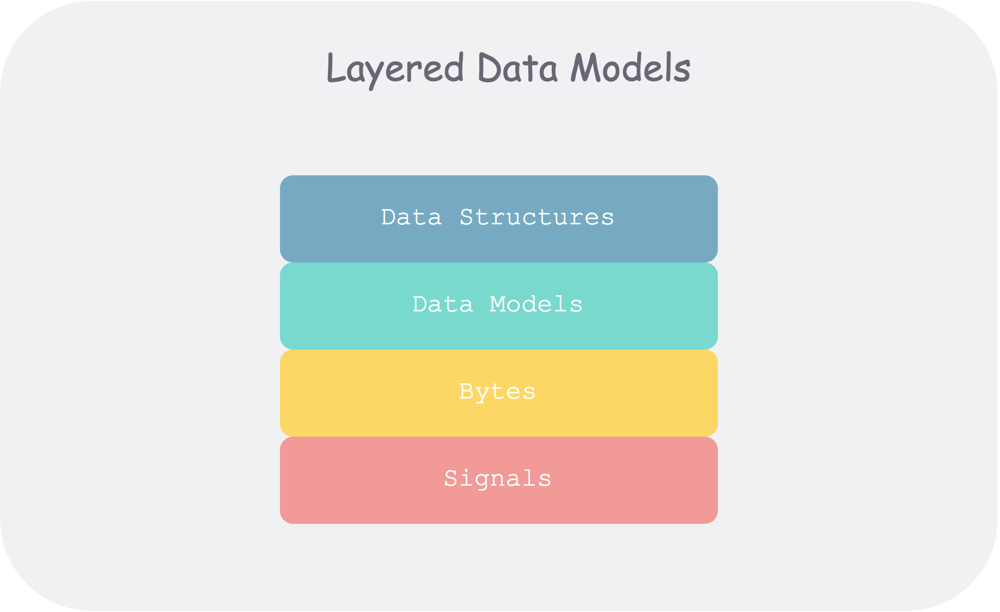

## 什么是数据密集型应用
当数据（数据量、数据复杂度、数据变化速度）是一个应用的主要挑战，那么可以把这个应用称为数据密集型的。与之相对的是计算密集型——处理器速度是主要瓶颈。
 
随着芯片技术的不断发展，我们平时遇到的大部分系统都是数据密集型的——应用代码访问内存、硬盘、数据库、消息队列中的数据，经过业务逻辑处理，再返回给用户。

因此，很多系统都是在解决不同场景下的数据存储和检索问题: MySQL，Redis，HBase，Kafka，ElasticSearch等。

我们经常讨论的很多技术手段也都是围绕着数据处理展开的: 索引，编解码(json,pb,xml), 行列存储等。

当今的互联网应用为了应对庞大的用户访问，一定是分布式的，那么在数据层面就要考虑：数据备份，数据分区，数据一致性等。

同样的，在大数据场景下，我们需要了解：MapReduce, Spark, Flink 等批处理、流处理框架。

## 数据模型
数据模型：如何组织数据，如何标准化关系，如何关联现实。

它既决定了我们构建软件的方式（实现），也左右了我们看待问题的角度（认知）。

作者开篇以计算机的不同抽象层次来让大家对泛化的数据模型有个整体观感。

大多数应用都是通过不同的数据模型不断累加构建的。

每层模型核心问题：如何用下一层的接口来对本层进行建模？
1. 作为应用开发者， 你将现实中的具体问题抽象为一组对象、数据结构（data structure） 以及作用于其上的 API。
2. 作为数据库管理员（DBA），为了持久化上述数据结构，你需要将他们表达为通用的数据模型（data model），如文档数据库中的 XML/JSON、关系数据库中的表、图数据库中的图。
3. 作为数据库系统开发者，你需要将上述数据模型组织为内存中、硬盘中或者网络中的字节（Bytes） 流，并提供多种操作数据集合的方法。
4. 作为硬件工程师，你需要将字节流表示为二极管的电位（内存）、磁场中的磁极（磁盘）、光纤中的光信号（网络）。

### 关系模型与文档模型

| 数据类型 | 文档型 | 关系型 |
| ---- | ---- | ----- |	
| 对应关系 | 数据有天然的一对多、树形嵌套关系，如简历。	| 通过外键 + Join 可以处理 多对一，多对多关系 |
| 代码简化   | 数据具有文档结构，则文档模型天然合适，用关系模型会使得建模繁琐、访问复杂。但不宜嵌套太深，因为只能手动指定访问路径，或者范围遍历	| 主键，索引，条件过滤 |
| Join 支持 | 对 Join 支持的不太好	| 支持的还可以，但 Join 的实现会有很多难点 |
|模式灵活性|弱 schema，支持动态增加字段|强 schema，修改 schema 代价很大|
| 访问局部性 | 1. 一次性访问整个文档，较优 2. 只访问文档一部分，较差 |分散在多个表中|

说文档型数据库是 schemaless 不太准确，更贴切的应该是 schema-on-read。

| 数据模型	| |	编程语言 |	|	性能 & 空间 |
| ----- | -- | --| -- | -- |
| schema-on-read | 写入时不校验，而在读取时进行动态解析。 |	弱类型 |	动态，在运行时解析 | 读取时动态解析，性能较差。写入时无法确定类型，无法对齐空间利用率较差。 |
| schema-on-write |	写入时校验，数据对齐到 schema |	强类型 |静态，编译时确定|	性能和空间使用都较优。 |

文档型数据库使用场景特点：
- 有多种类型的数据，但每个放一张表又不合适。
- 数据类型和结构又外部决定，你没办法控制数据的变化。
- 如果你同时需要文档中所有内容，把文档顺序存会效率比较高。
- 但如果你只需要访问文档中的某些字段，则文档仍需要将文档全部加载出。

> 关系型和文档型的融合
MySQL 和 PostgreSQL 开始支持 JSON 原生支持 JSON 可以理解为，MySQL 可以理解 JSON 格式。如 Date 格式一样，可以把某个字段作为 JSON 格式，可以修改其中的某个字段，可以在其中某个字段建立索引。
