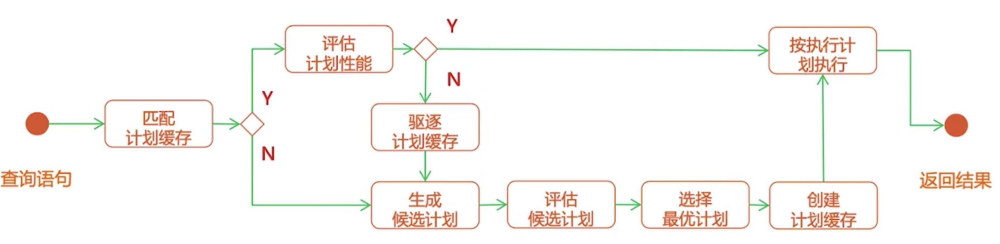

> 上篇文章写了 MongoDB 的索引原理，本篇就来聊一聊和索引息息相关的 MongoDB 查询计划

**从一个普通查询说起**

首先我们先来一个普通的查询，比如查询某个用户下所有的动态(moments)
```javascript
db.moments.createIndex({author_id: 1})
db.moments.find({author_id: ObjectId("595c2ad34dd6a36bb9cf6bc4")}).explain("executionStats")
{
  "queryPlanner" : {
    "plannerVersion" : 1,
    "winningPlan" : {
      "stage" : "FETCH",
      "inputStage" : {
        "stage" : "IXSCAN",
        "keyPattern" : {
          "author_id" : 1
        },
        "indexName" : "author_id_1",
        }
      }
    },
    "rejectedPlans" : []
  },
  "executionStats" : {
    "executionSuccess" : true,
		"executionTimeMillis" : 0,
		"totalKeysExamined" : 2,
		"totalDocsExamined" : 2,
    "nReturned" : 2,
    "executionStages" : {
      "stage" : "FETCH",
      "nReturned" : 2,
      "inputStage" : {
        "stage" : "IXSCAN",
        "nReturned" : 2
      }
  }
}
```
- 通过 explain 方法我们得到了一个 queryPlanner 对象，这就是此次查询操作的查询计划
- 针对每次查询操作，存储引擎都会同时发起多个查询计划（当然也有查询计划缓存，我们后边说），winningPlan 表示此次查询中胜出的计划，也就是执行的计划
- 通过观察 winningPlan 对象，我们发现此次查询经历了两个阶段（stage），索引查询阶段(IXSCAN: Index Scan）和获取数据阶段（Fetch）
- 通过观察 executionStats 对象，我们可以获取查询计划详细的执行情况，如何上例中可以看到索引定位了2条数据，最后返回了2条数据，执行时间几乎为0ms，这说明此次索引命中率为100%，是高效的查询。

我们再来看一下没有索引的情况
```javascript
db.moments.dropIndex({author_id: 1})
db.moments.find({author_id: ObjectId("595c2ad34dd6a36bb9cf6bc4")}).explain("executionStats")
{
  "queryPlanner" : {
    "plannerVersion" : 1,
    "indexFilterSet" : false,
    "parsedQuery" : {
      "author_id" : {
        "$eq" : ObjectId("595c2ad34dd6a36bb9cf6bc4")
      }
    },
    "winningPlan" : {
      "stage" : "COLLSCAN",
      "filter" : {
        "author_id" : {
          "$eq" : ObjectId("595c2ad34dd6a36bb9cf6bc4")
        }
      },
    },
    "rejectedPlans" : [ ]
  },
  "executionStats" : {
    "executionSuccess" : true,
    "nReturned" : 2,
    "executionTimeMillis" : 463,
    "totalKeysExamined" : 0,
    "totalDocsExamined" : 428951,
    "executionStages" : {
      "stage" : "COLLSCAN",
      "filter" : {
        "author_id" : {
          "$eq" : ObjectId("595c2ad34dd6a36bb9cf6bc4")
        }
      },
      "nReturned" : 2,
      "executionTimeMillisEstimate" : 422,
      "works" : 428953,
      "advanced" : 2,
      "needTime" : 428950,
      "needYield" : 0,
      "saveState" : 3360,
      "restoreState" : 3360,
      "isEOF" : 1,
      "invalidates" : 0,
      "direction" : "forward",
      "docsExamined" : 428951
    }
  }
}
```
- 我们发现去掉索引之后，winning Plan 只走了一个全表扫描阶段(Collection SCAN), 遍历了40万条数据，耗时463ms，由此可以看出，索引对于提高查询性能的重要性 

**执行计划的筛选与缓存**

我们在上例中看到了 queryPlanner 包含两个属性 winningPlan 和 rejectedPlans，说明在执行 winningPlan 之前有一个选举和淘汰过程。事实确实是这样的，而且不光如此，为了提高执行计划选举效率，存储引擎会对每一次的winningPlan进行缓存，方便下次使用。具体流程如下:


- 存储引擎接收到查询请求后，会先看一下有没有与此请求匹配的计划缓存
- 如果有缓存，则评估一下是否针对此次查询仍然是高效的，如果是则按此计划执行查询，返回结果
- 如果没有缓存，或者原有的计划缓存性能检测不合格，则会重新生成新的执行计划
- 根据已建立的索引的不同，会生成多份不同的执行计划，这些执行会并发执行，谁的性能好就选谁为 winningPlan(所以尽量避免针对同一字段或同一查询场景建立多份索引)
- 选出 winningPlan 之后，为其创建计划缓存，并按此计划执行查询，返回结果

**参考资料**
- https://docs.mongodb.com/manual/core/query-optimization/
- 极客时间-MongoDB高手课