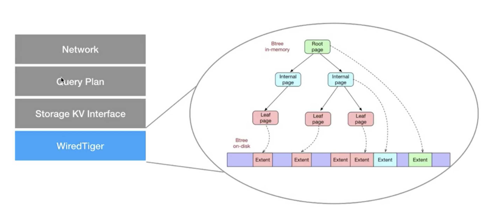

> 最近通过 ElasticAPM 发现代码中有几处慢查询，通过对每个查询语句 explain、profiling 分析发现，都基本上和索引有关。所以查资料好好学习了一下 MongoDB 的索引相关知识。

**MongoDB 的整体结构**

在说索引之前，需要先跟大家说下 MongoDB 的整体结构，这样会有一个全局的概念。


MongoDB 整体结构分为4层，分别为:
  - Network 网络层：负责接收客户端的请求
  - Query Plan 查询计划层：将网络层的请求封装为一系列的数据库访问操作
  - Storage KV Interface KV接口层：将查询计划层的访问操作封装成一系列的Key-Value接口，供下层的存储引擎使用
  - WiredTiger 存储引擎：最后由存储引擎负责执行具体的工作，将操作落地

**B-Tree数据结构**

WiredTiger 作为性能极佳的MongoDBv3.2版本之后官方默认的存储引擎，这里简单说下其内部的数据结构。
  - WiredTiger 默认采用 B-Tree 的数据结构实现
  - B-Tree 简单理解就是平衡多叉树，由AVL树发展而来，特点就是单个节点的查询会比较快，因为树的深度相对较小, B-Tree 中的每个节点都会存储数据
  - 整个的数据存储方式分为内存存储和硬盘存储，比如频繁使用的索引，或者和写入操作关联频繁的索引，都会优先放在内存中存储，减少磁盘IO操作

说到B-Tree数据结构，大家一定就会想到B+Tree，那B-Tree和B+Tree有哪些区别呢？
  - B+树中的节点不存储数据，只是索引，而B树中的节点存储数据
  - B+树中的叶子节点使用链表指针来串联，目的是为了做范围查询时更高效，而B树中的叶子节点并不需要链表来串联

MongoDB 之所以采用 B-Tree 作为索引底层的数据结构，而不是像 MySQL 一样采用 B+Tree，主要是和其非关系型数据库的设计理念相关。

MongoDB 认为单个文档的查询是最常见的场景，所以B-Tree中的每个节点都储存数据这个条件更加符合，同样是查一条数据，B+Tree要到达叶子节点之后才能拿到存储的数据。

那对于遍历查询的场景呢？比如我要查询某篇动态下所有的评论。如果使用传统的表关联查询思路来看的话：
```javascript
// MySQL
select * from comments where moment_id = 1
// MongoDB
db.comments.find({moment_id: 1})
```
那毫无疑问，肯定是 MySQL 的性能要高于 MongoDB 性能。因为 MySQL 可以快速找到索引Comment.moment_id, 通过B+Tree叶子节点的串联找到相应符合条件的comments返回。而 MongoDB B-Tree的所有节点都存有数据，并且节点之间没有串联关系，所以性能会差一些。   

但不要忘了，MongoDB 推荐的文档模型设计并不是这样的，是不需要遵从第三范式的(数据库设计第三范式简单讲就是每个表中没有冗余字段，通过关系进行关联)。MongoDB 鼓励使用内嵌文档的方式来表达collection之间的关联关系。即，将 moment 和属于它的所有 comments 都存储在一起。

这样我们就可以在查询单个moment文档时，获取它的所有comments了，而这，又回到了B-Tree所高效的领域了。

综上，简单概述了MongoDB的索引原理知识，抛了个砖，感兴趣的读者，可以根据下方的参考资料继续深入研究。

**索引使用的一些Tips**

- 索引不是越多越好，删除无效索引和重复索引
  ```javascript
    // Index Prefix：联合索引会包含前缀索引，即下面的索引包含了 {a: 1}, {a: 1, b: 1} 两个索引，不用重复定义了
    db.createIndex({a: 1, b: 1, c: 1})
  ```
- 多使用 Covered Query 查询覆盖，查询效率更高
  ```javascript
    // Covered Query: 需要的字段都在索引里了，可以直接返回，不需要再去定位到数据页拿数据了
    // 1 表示要的数据，0表示不要的数据
    db.users.find({name: 'xxx'}, {name: 1, _id: 0})
  ```
- 关注索引过滤性 Selectivity, 过滤性就是筛选数据的能力，筛掉的数据越多，说明过滤性越好，用它建索引效果就越好。