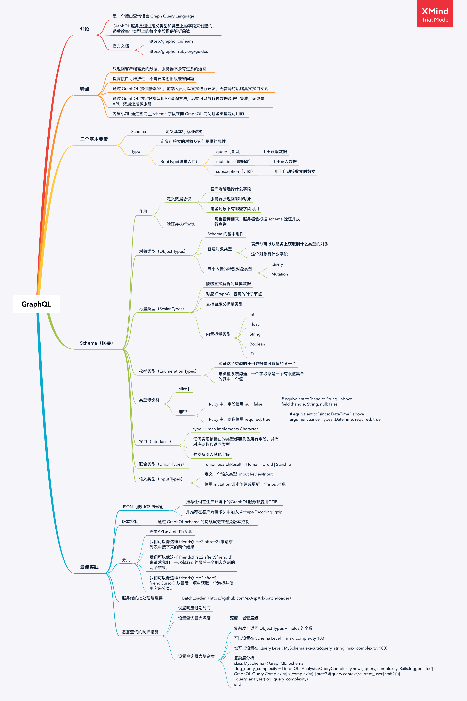

提起API设计，大家一定会想到目前仍在流行的 RESTful API，其因为易于理解的设计理念，被大家广泛接受。

笔者所在公司用的也是 RESTful，它的优点自不必说了，来说说在使用中的痛点。

- **字段冗余**
  - 随着前端（Web端&移动端）的体验越来越丰富，差异和场景化越来越重视，不同端对同一内容的数据需求是不一样的
  - 微信H5页面起导流作用，只用到某个模型的少量数据，但除非服务器端出一个专用接口，否则H5就要访问大接口去取少量数据，浪费网络带宽
  - 而出专用接口，看似是一个简单的解决方案，但要考虑之后的业务修改，代码维护性，对服务器端只会增加很多繁杂的工作
- **扩展性差**
  - 随着业务逻辑越来越复杂，产品需求不断进化，就会产生很多当时有效，现在没用的字段
  - 但这些字段你又不能不返回，因为需要兼容旧的客户端版本。
  - 只能是积累到一定量，或者遇到一个大功能点，升级某个Model的API版本（旧版访问api/v2，新版访问api/v3这种）
  - 增加服务器端的维护成本
- **按资源访问接口；无法聚合访问；网络请求次数多**
  - RESTful API的原则是按资源及其资源行为划分接口
  - 比如直播详情接口中只放直播相关的数据，其他资源的详细信息是不应该出现在此接口中的，顶多是ReferID属性
  - 但有些页面就是需要多个资源的信息（比如：发现页、推荐页等），此时只能是根据页面定制出接口给客户端，
  - 不然客户端就要发起多次请求，网络请求次数多，而那些定制的接口，也要随着页面的变化而变化，前后端很耦合
  - 当然如果你觉得需求不合理，先和产品沟通再想技术方案一般会更好！

由于以上痛点，我关注到了 GraphQL, 它自喻可以解决上述问题，让我们来看看，它要怎么解决。

