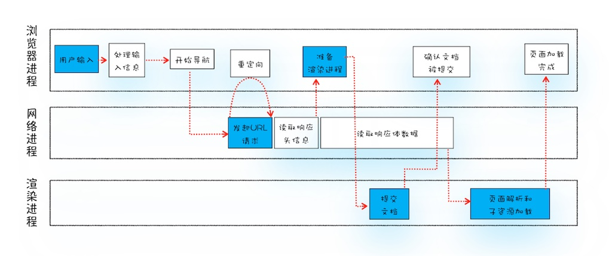

> 从输入 URL 到页面展示，这中间发生了什么？我认为这个问题是所有搞Web开发的人都能如数家珍的射程范围

> 浏览器进程：
  - 用户输入URL，浏览器根据用户输入的信息判断是搜索还是网址，根据URL协议，合成完整的URL
  - 通过进程间通信(IPC)把URL请求发送给浏览器网络进程

> 浏览器网络进程：
  - 说到URL请求后，检查本地资源缓存是否缓存了请求资源，如果有，拦截请求，返回200状态码及资源
  - 如果没有，查询DNS缓存是否缓存过当前域名IP信息，如果也没有，将域名发送给DNS服务器，让它解析IP地址
  - 获取IP和端口后，开始建立TCP连接，如果是HTTPS协议，还需要建立TLS连接
  - 完成TCP三次握手或TLS四次握手后，浏览器开始构建请求头信息，并把该域名相关的Cookie附加到请求头中，然后想服务器发起请求信息

> 服务器：
  - 服务器接收到请求信息后，根据根据请求信息生成相应数据，返回给客户端

> 浏览器网络进程：
  - 解析响应头，判断状态码，
  - 如果是301或302，则再次向响应头的location字段地址发起HTTP或HTTPS请求
  - 如果是200，则表示一切正常，可以继续读取响应数据
    - 读取响应头中的Content-Type字段，好知道响应数据是什么类型，如何处理数据
    - 如果是 application/octet-stream 字节流类型，则浏览器会按照下载类型来处理该请求
    - 如果是 text/html，则网络进程会通知浏览器进程，准备渲染进程，要渲染HTML了
    - 还没完事，只是告知了要准备渲染进程，但数据还在浏览器网络进程中，所以需要浏览器进程协调一下
    - 事实上，当打开一个页面的时候，渲染进程就已经启动了，而且如果是相同协议和根域名(同一站点)，子页面会复用父页面的渲染进程

> 浏览器进程：
  - 浏览器进程接收到网络进程的通知后，便向渲染进程发消息，告诉渲染进程，你去向网络进程要数据，然后渲染页面

> 渲染进程：
  - 收到浏览器进程消息后，渲染进程会和网络进程建立传输数据的“管道”，开始传输数据，传输完成后，渲染进程会返回“确认提交”的消息给浏览器进程
  - 然后渲染进程便开始页面解析和子资源加载，HTML通过 HTML Parser转成 DOM Tree，CSS按照规则转成CSSOM Tree，两个 Tree 结合，形成render tree，然后通过layout
  - 一旦页面生成完成，渲染进程会发送一个消息给浏览器进程，说渲染完事了

> 浏览器进程：
  - 收到“确认提交”消息后，会更新浏览器界面状态，包括了安全状态、地址栏的URL、前进后退的历史状态、并更新Web页面，此时Web页面是空白页
  - 收到“页面生成完成”消息，浏览器进程停止标签图标上的加载动画，所有执行完成