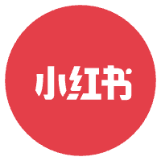

<h2 style="text-align: center;">👨‍💻Happy Engineer</h2>

 🤾‍♂️ Hi, I'm Weidong, base 北京 

 🌟 9 年后端开发经验，擅长 golang/ruby 微服务开发 

 🏂 平时也会玩一些 Node/Swift 全栈开发, 懂一些产品设计和数据分析 

 🚴‍♂️ 喜欢探究业务背后的需求本质，然后用合适的技术手段满足它 

 🧗‍♂️ 工作中常用的技术栈有 Redis, MySQL, MongoDB, Kafka, Docker, K8S, AWS Infras, Terraform 

<h2 style="text-align: center;">感兴趣的业务领域</h2>

    
 AIGC 应用落地探索 

    
 SaaS 出海服务探索 

    
 医疗与少儿教育板块 

<h2 style="text-align: center;">有经验的业务领域</h2>

    
 电商亿级商品菜单数据系统设计 

    
 知识付费社群产品从0-100 

    
 微服务 DevOps 系统调优 

    
    
    

