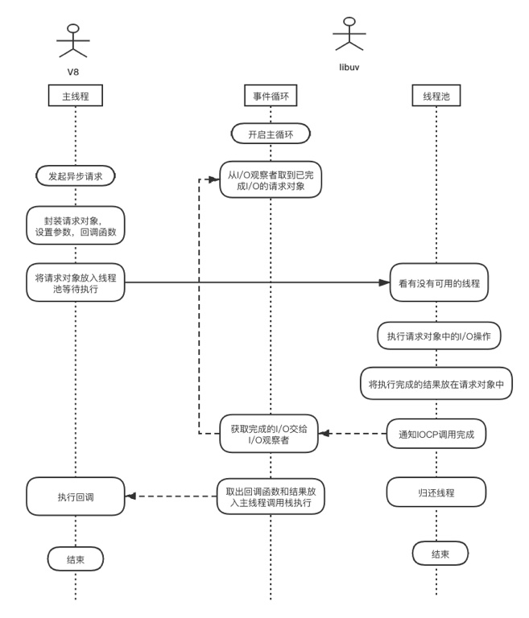

#### Node 异步I/O流程

事件循环、观察者、请求对象、I/O线程池这四者共同构成了Node异步I/O模型的基本要素

- 首先Node服务启动，libuv开启主循环，初始化线程池，加载Node Native Module，执行JS代码
- 执行JS的主线程发现有异步I/O调用，于是创建请求对象，将异步I/O的参数与回调函数封装到请求对象上，然后将请求对象交给线程池处理，自己继续往下执行
- 线程池接收到请求对象后，会先检查当前是否有空闲的线程，如果有，就交给线程去处理I/O
- I/O操作处理完成后，执行任务的线程会调用IOCP通知I/O观察者已处理完毕
- 事件循环在Tick循环的poll阶段发现有已完成的I/O操作了，将已完成的I/O交给I/O观察者
- 事件循环从I/O观察者中获取到请求对象，取出回调函数和异步I/O执行结果，放入主线程调用栈等待被执行
- JS主线程执行调用栈中的回调函数
- 整个过程完成