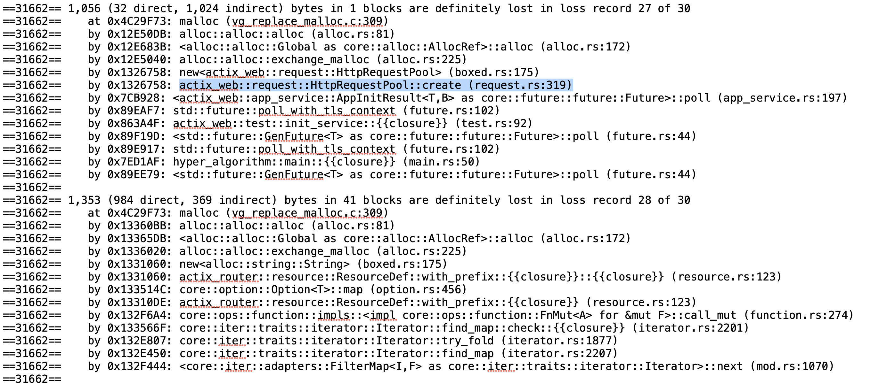

> 记一次排查actix-web内存泄漏问题

### 现象:
在新搭建的测试环境下, 压测后系统占用大概500M+内存, 运行几天后, 内存飙到8GB, 猜测应该是哪里存在内存泄漏.

### 排查:
1. 对核心采集指令服务进行测试, 没有发现明显的内存泄漏.
2. 对算法服务提供的核心接口进行测试, 发现随着请求数的增多, 内存会不断上涨, 使用 valgrind 对算法库核心接口进行内存泄漏分析，可以得到如下的报告, 猜测可能与 actix_web 库的此处有关.

3. 仅使用 actix-web 框架，编写一个简单的 web 服务，使用 golang 编写 client 客户端，不断使用新的 socket 连接进行请求。开始时 actix-web 程序占用内存大概 20MB 左右，持续请求两小时后内存占用提高到了 400MB，并且在请求停止一段时间后没有下降。基本确认确实是 actix_web 的问题.
4. 查看 actix-web 源码 v2.0，可以在 src/request.rs 文件的 325 行看到：

5. 查看官方文档, 对 Box::leak 方法有如下解释:

### 解决:
咨询 actix-web 官方表示, 已经在 v3.0 对 v2.0 的多处内存分配处理不当的地方进行了优化, 目前最新的代码中已经替换了相关实现.
